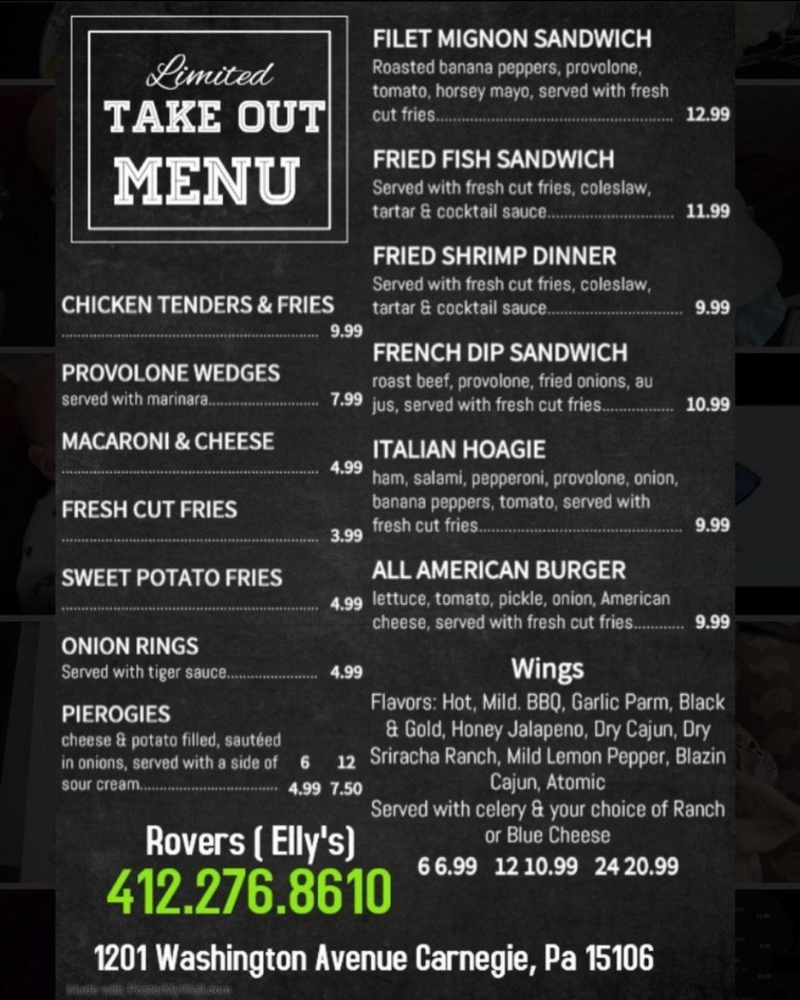

layout: page
title: " Full Takeout Menu"
permalink: https://earth2andrew.github.io/mywebsite/fullmenu

<!Doctype html>
<html>
<head>
  <!-- Global site tag (gtag.js) - Google Analytics -->

</head>
<body>

</body>
</html>
